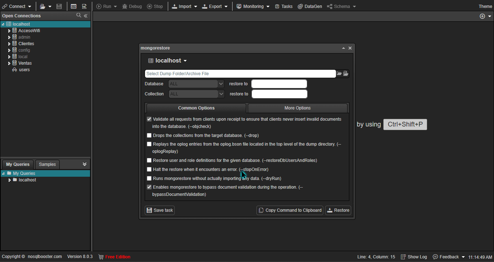
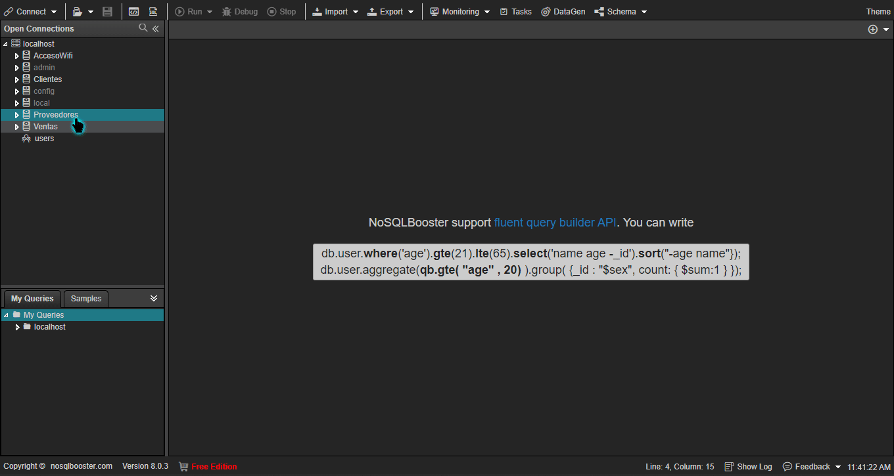
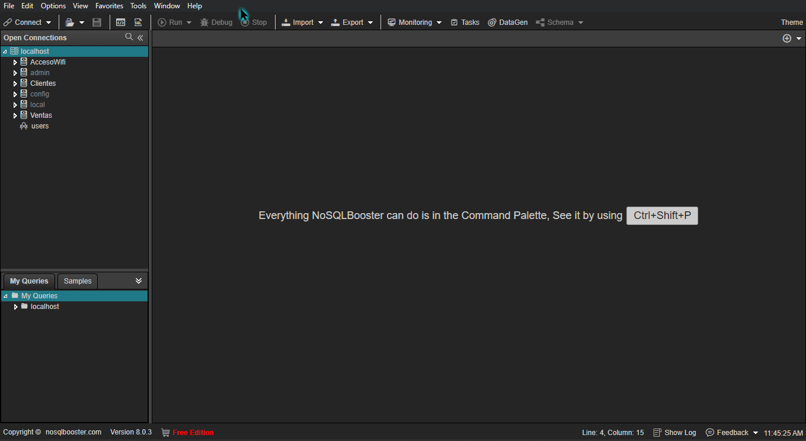
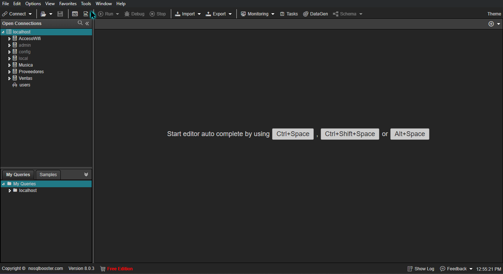
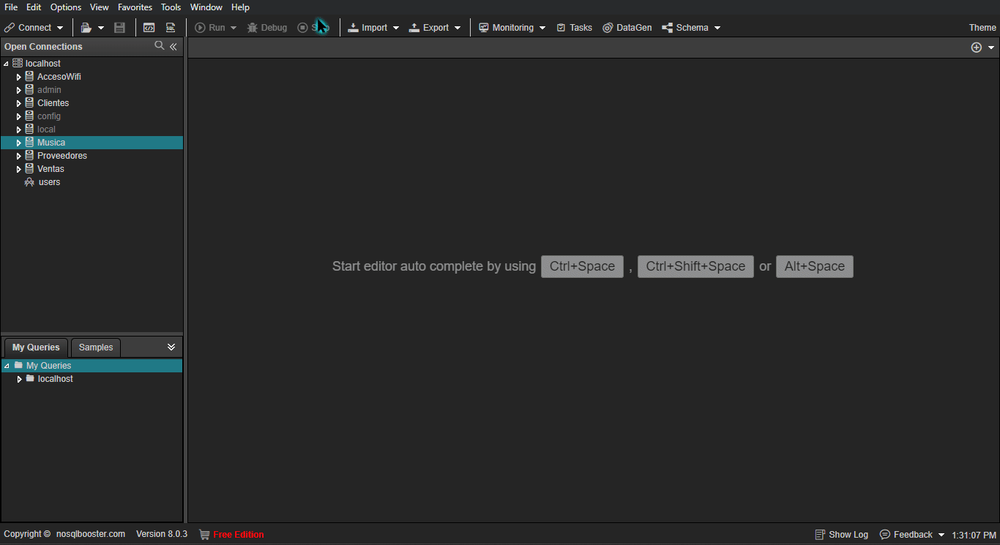

# Mongo Dump | Mongo Restore | Mongo Import | Mongo Export

---

## Mongo Dump

### Pasos:

* Seleccionar Tools
* Mongo Utilities (Requiere Mongo Binary)
* Mongodump
* Seleccionar carpeta o crear una.
* Seleccionar **Dump**

---

## Mongo Restore

### Pasos:

"Para este ejemplo se eliminará la base de datos **Proveedores** "

* Seleccionar Servidor
* Seleccionar Tools
* Mongo Utilities (Require Mongo Binary)
* Mongorestore
* Seleccionar carpeta
* Seleccionar Base de datos (Proveedores)  y colección (Todas /all)

---

## Mongo Import

### Pasos:

* Seleccionar Servidor
* Seleccionar Tools
* Mongo Utilities (Require Mongo Binary)
* Mongoimport
* Seleccionar archivo para adjuntar
* Asignar nombre a la base de datos
* Seleccinoar Import

---

## Mongo Export

### Pasos:

#### Exportar Colección/es

* Seleccionar Servidor
* Seleccionar Tools
* Mongo Utilities (Require Mongo Binary)
* Mongoexport
* Seleccionar carpeta donde se guardará el export
* Seleccinoar el tipo de archivo en el que se exportará
* Seleccionar Export

