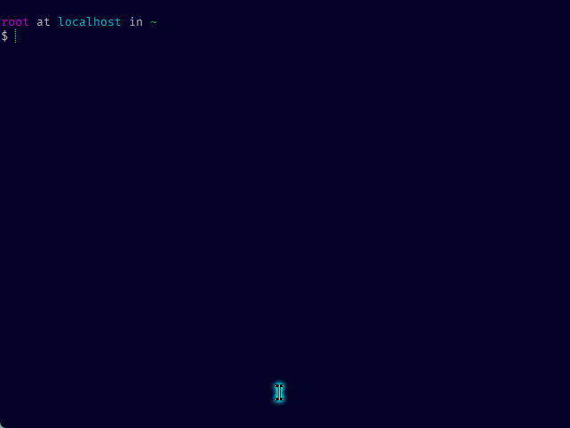
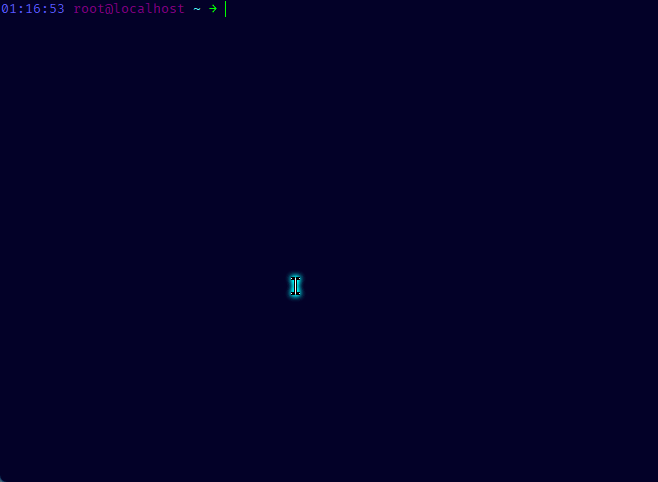
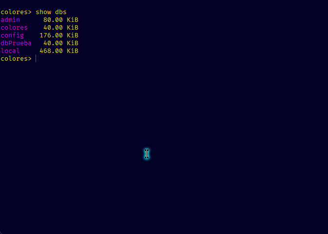

# Mongo Dump

## Mongo Dump de todas las db

### Servidor 1

* Iniciamos la instancia de mongo ` mongod` en nuestro servidor 1
* Entramos a la shell de mongo con `mongosh`
* Listamos las bases de datos con `show dbs`
* Creamos una base de datos (en este caso sera la de colores)
* Agregaremos una colección y un documento
* Verificamos que se hayan creado correctamente



### Servidor 2

* En el servidor 2 haremos el respaldo de las db del servidor 1.
* Insertamos lo siguiente:

  ```
  mongodump --uri="mongodb://IP de donde realizará el dump:puerto"
  ```

  *Ejemplo:*
  `mongodump --uri="mongodb://192.168.1.90:27017"`

  * Se habrá creado un carpeta llamada "dump"
  * Ingresando a ella podemos observar que se encuentran las db del servidor 1



---

## Respaldo de una colección

### Servidor 1

*Para este ejemplo se creará la colección colores2 con un documento*



### Servidor 2

* En el servidor 2 se hará el respaldo de la colección **colores2**
* Insertamos lo siguiente:

```
mongodump --uri="mongodb://Ip de donde se realizará el dump:puerto" --db "nombre de la base de datos" --collection "nombre de la coleccion"
```

*Ejemplo:*
`mongodump --uri="mongodb://192.168.1.90:27017" --db colores --collection colores2`

* Nos dirigimos a la carpeta *dump*, base de datos *colores*
* Observamos que se creó el dump de la colección *colores2*


