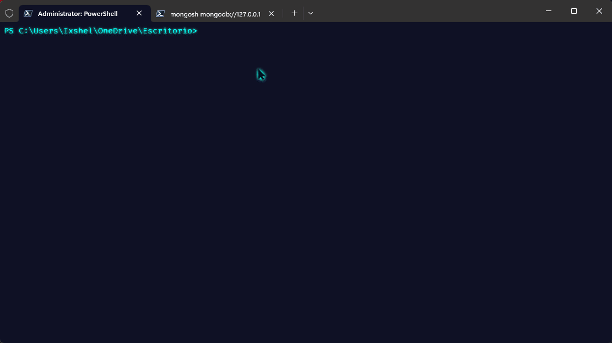
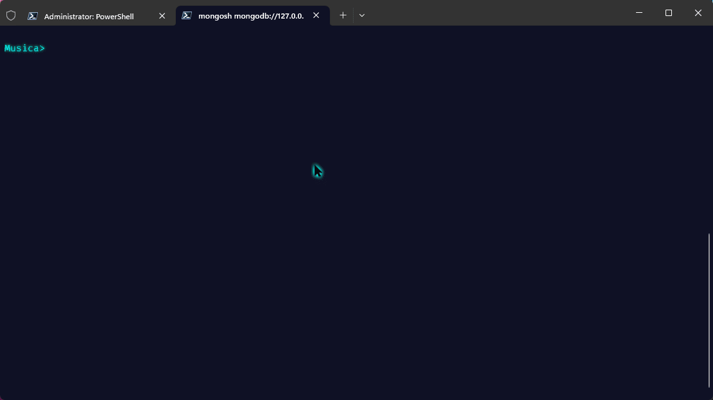
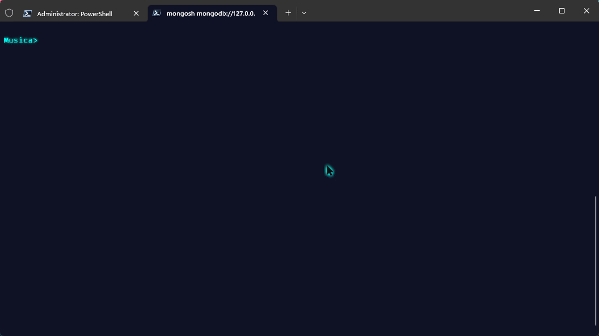
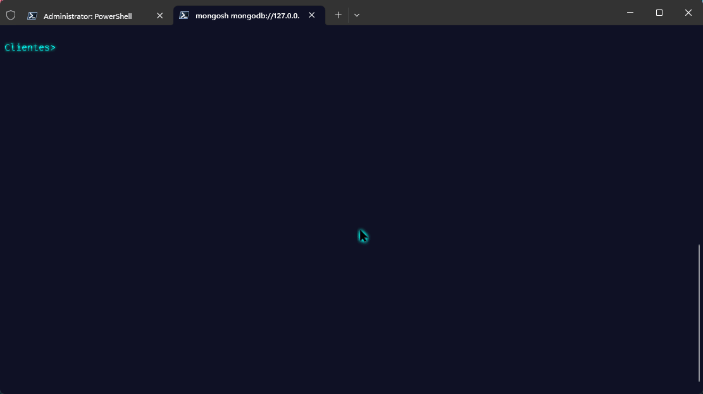
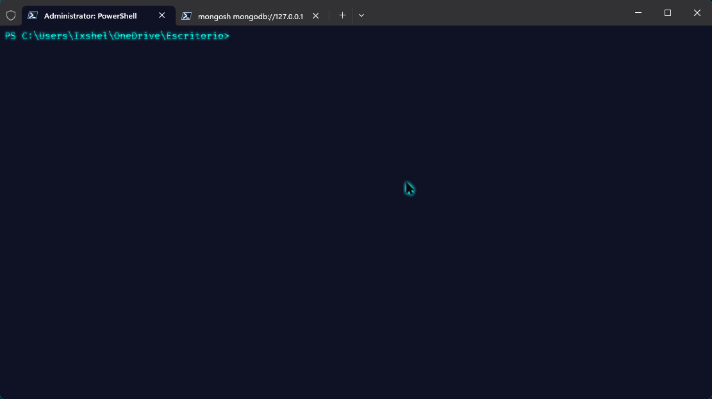

# Mongo Dump | Restore | Import | Export desde la Shell

---

## Mongo Dump

* Iniciamos el mongo (mongod)
* En la shell nos dirigimos a la ubicación donde se generará la carpeta "dump". Ahí se almacenará el respaldo de las bases de datos que tenemos.
* Para realizar el respaldo de todas las bases de datos que tenemos se ingresar:

  `mongodump`


### Respaldo de una DB en específico

* En la shell ingresamos lo siguiente:

```
mongodump --db "la db que queremos respaldar"
```

*Ejemplo:*
`mongodump --db Musica`

* En este caso se hizo el respaldo de la base de datos "Musica"



### Respaldo de una colección

* Checamos en la mongoshell cuál será la colección que queremos respaldar.
* Una vez decidida la colección, nos dirigimos a la shell de nuestro SO.
* Ingresamos lo siguente:

```
mongodump --db "la db donde se encuentra nuestra colección" --"la colección que vamos a respaldar"
```

*Ejemplo:*
`mongodump --db Musica --collection titulos`



---

## Mongo Restore

* Para restaurar todas las bases de datos que tenemos en Dump, ingresamos lo siguiente:

  `mongorestore`


#### db.dropDatabase()

* Vemos las bases de datos en el mongoshell
* Para este ejemplo eliminaremos la base de datos "Ventas"

  `db.dropDatabase()`



### Respaldo de una Base de datos específica

* En la shell de nuestro SO, ingresamos el siguiente comando:

```
mongorestore --db "la db que vamos a restaurar" "carpeta donde se hizo el respado/ nombre de la db"
```

*Ejemplo:*
`mongorestore --db Ventas dump/Ventas`



### Respaldo de una Colección específica

* En la sell de nuestro SO, ingresamos el siguiente comando:

```
mongorestore --db "nombre de la base de datos donde se encuentra la colección" --collection "nombre de la colección" "carpeta donde se encuentra la db"/"nombre de la db"/"nombre de la coleccion".bson
```

*Ejemplo:*

`mongorestore --db Musica --collection generos dump/Musica/generos.bson`



